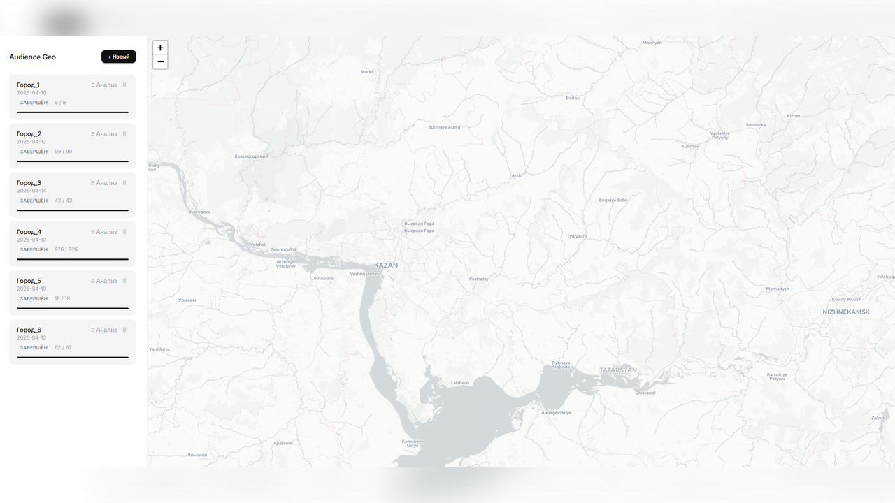
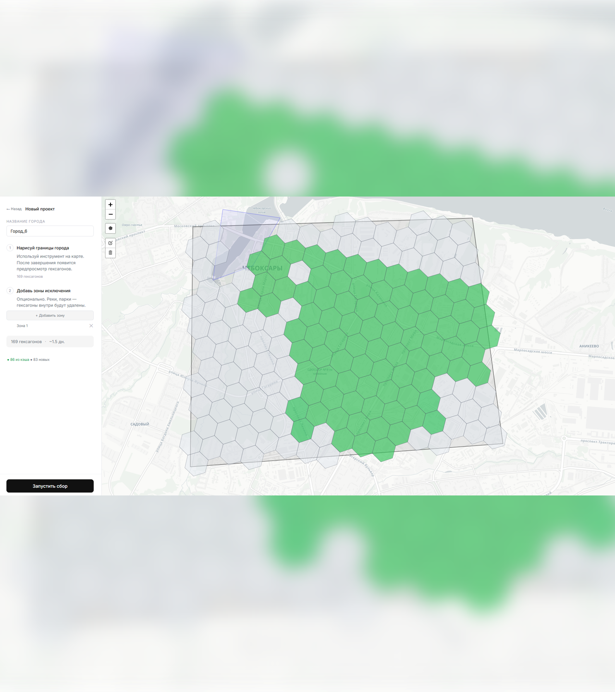
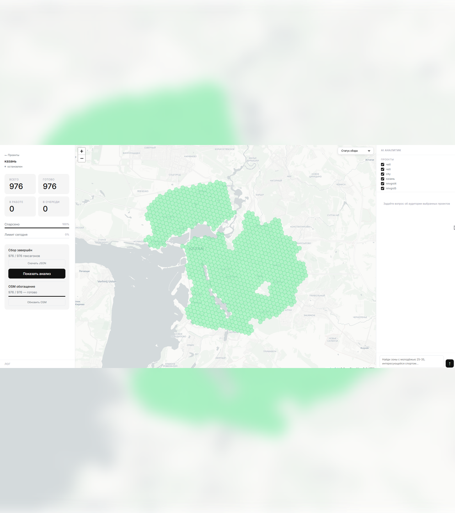
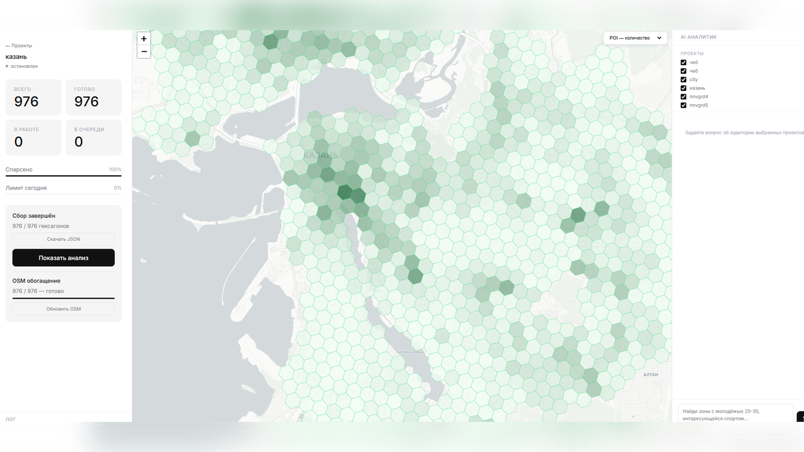
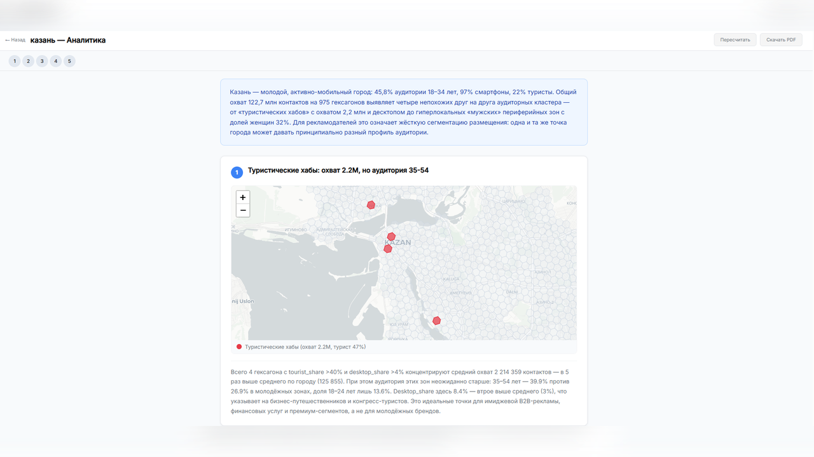
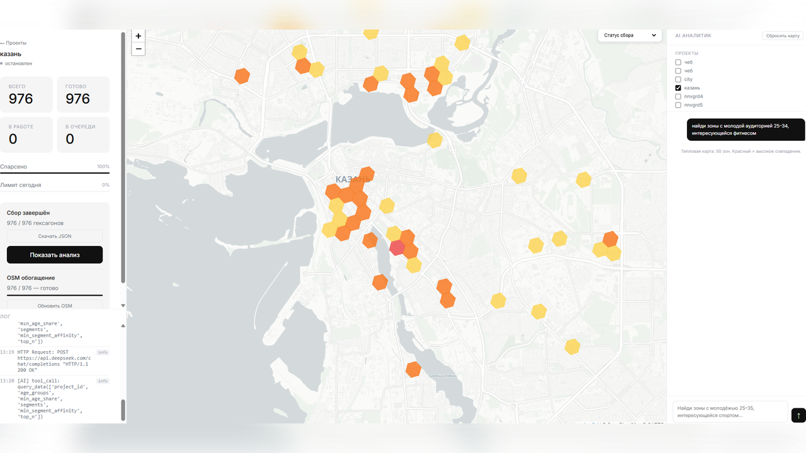

# audience-geo

**Инструмент автоматического сбора и анализа аудиторных данных для компаний наружной рекламы.**

Покрывает весь город H3-гексагонами (~250м на ячейку), собирает демографические профили через API и браузерную автоматизацию Яндекс.Аудиторий, обогащение OSM данными, затем запускает AI-анализ для выявления паттернов — всё через одностраничный веб-интерфейс.

> Создан как внутренний инструмент для компании наружной рекламы: отделу продаж и аналитикам нужен аудиторный портрет (возраст, пол, интересы, устройства) для любой рекламной конструкции в нескольких городах.

---

## Проблема

Яндекс.Аудитории агрегируют данные о поведении пользователей по геозонам — но статистика доступна **только через UI** (без API-эндпоинта). Прямой API возвращает лишь технические метаданные сегментов. При тысячах рекламных конструкций в нескольких городах ручной сбор невозможен.

**Ограничения, которые определили всю архитектуру:**

| Ограничение | Значение |
|---|---|
| Макс. сегментов на аккаунте | 1 000 |
| Создание сегментов / минута | 30 |
| Создание сегментов / час | 100 |
| Создание сегментов / сутки | 500 |
| Обработка сегмента | Асинхронно, от минут до часов |
| Эндпоинт статистики | **Только UI — необходима браузерная автоматизация** |

---

## Как работает

1. **Нарисовать границу города** в веб-интерфейсе → система генерирует гексагональную сетку, покрывающую всю территорию
2. **Предпросмотр кэша** — мгновенно показывает, у каких гексагонов уже есть свежие данные (зелёный), устаревшие (оранжевый) или новые (серый), с оценкой времени сбора
3. **Пайплайн запускается автоматически** — создаёт сегменты в Яндексе батчами, поллит статусы, перехватывает статистику через XHR в Playwright, сохраняет результаты
4. **Глобальный SQLite-кэш** — собранные данные гексагонов переиспользуются между проектами; повторный сбор по уже известному городу занимает секунды
5. **OSM-обогащение** — каждый гексагон получает геоконтекст из OpenStreetMap: количество и разнообразие POI, плотность дорог, остановки транспорта, данные о застройке и землепользовании
6. **AI-анализ** — Claude Sonnet запускает агентский цикл (tool use), самостоятельно находит нетривиальные паттерны в данных и генерирует структурированный отчёт с интерактивными картами и графиками
7. **AI-чат** — сайдбар в экране мониторинга для произвольных запросов («найди зоны с аудиторией 25–34, интересующейся спортом»)

---

## Скриншоты

### Главный экран — список проектов и форма создания



---

### Предпросмотр кэша — статус гексагонов перед сбором



---

### Экран мониторинга — дашборд сбора в реальном времени



---

### OSM-слой — инфраструктурный контекст на карте



---

### Экран аналитики — AI-отчёт с инсайтами



---

### AI-чат — произвольные запросы по аудитории



---

## Архитектура

```
┌─────────────────────────────────────────────────────────────────────┐
│  Фронтенд (Vanilla JS + Leaflet + Chart.js)                         │
│  3 экрана: Список проектов → Мониторинг → Аналитика                 │
│  WebSocket лог в реальном времени · Поллинг метрик · AI-чат         │
└──────────────────────┬──────────────────────────────────────────────┘
                       │ REST API + WebSocket
┌──────────────────────▼──────────────────────────────────────────────┐
│  FastAPI сервер (server.py)                                         │
│  Поток оркестратора · Поток OSM-обогащения · Поток анализа          │
└──┬───────────────────────────────────┬───────────────────────────────┘
   │                                   │
┌──▼──────────────────┐   ┌────────────▼────────────────────────────────┐
│  Пайплайн сбора      │   │  Пайплайн анализа                           │
│                      │   │                                             │
│  Генерация H3-сетки  │   │  Фаза 1: CSV → master_df                   │
│  Проверка кэша       │   │           KMeans (авто-K) + IsolationForest │
│  Батчи Yandex API    │   │                                             │
│  Playwright XHR      │   │  Фаза 2: Claude Sonnet tool-use цикл        │
│  Экспорт CSV         │   │           3–5 инсайтов → report.json        │
└──────────┬───────────┘   └────────────────────────────────────────────┘
           │
┌──────────▼────────────────────────────────┐
│  data/hex_cache.db (SQLite)               │
│  ├── hex_cache        — аудиторные данные │
│  └── hex_osm_features — OSM геоконтекст  │
└───────────────────────────────────────────┘
           │
┌──────────▼──────────────────────────────────┐
│  OSM Enricher (osmnx + geopandas)           │
│  Полигон города → Overpass API              │
│  Spatial join → фичи на каждый гексагон     │
│  POI / Дороги / Здания / Землепользование   │
└─────────────────────────────────────────────┘
```

### Статусы гексагонов в пайплайне

```
pending → in_yandex → processing → parsed → done
pending → cached   (данные из глобального кэша, Яндекс полностью пропущен)
```

---

## Ключевые архитектурные решения

### Глобальный кэш гексагонов
SQLite-кэш хранит данные гексагонов независимо от проекта. При создании нового проекта по ранее собранному городу кэш применяется первым — `cached`-гексагоны полностью пропускают пайплайн Яндекса. Первый сбор по городу (~800 гексагонов) занимает ~3 дня из-за лимитов API. Повторный сбор — секунды.

### Браузерная автоматизация для статистики
Яндекс.Аудитории предоставляют статистику только через UI. Пайплайн использует **Playwright**: открывает страницу сегментов в реальном браузере с сохранённой сессией авторизации, затем перехватывает XHR-ответ `getStatData`. Процесс запускается в headless-режиме после создания сегментов через API.

### Реальный счётчик слотов Яндекса
На аккаунте жёсткий лимит в 1 000 активных сегментов. При нескольких проектах в очереди у каждого могут быть «осиротевшие» сегменты от прерванных предыдущих запусков. При старте оркестратор запрашивает **реальное** количество из API Яндекса и использует его для расчёта слотов — это исключает как превышение лимита, так и излишне консервативное батчирование.

### OSM-обогащение как независимый процесс
Аудиторные данные и данные OSM имеют разные жизненные циклы: аудитория устаревает через 90 дней, POI и дороги стабильны месяцами. Связывать их в один пайплайн — искусственная зависимость. OSM-обогащение запускается отдельным фоновым потоком после завершения сбора, а также может быть вызвано вручную или применено к историческим проектам задним числом.

### AI-агент с tool use вместо шаблона
Модуль анализа использует Claude Sonnet с **tool use** вместо фиксированного шаблона отчёта. Агент вызывает 8 инструментов данных (`get_overview`, `get_correlations`, `find_zones`, `spatial_hotspots` и др.) в произвольном порядке и сам решает, какие 3–5 инсайтов наиболее ценны. Это выявляет нетривиальные паттерны, которые фиксированный шаблон пропустил бы.

### Адаптивный интервал поллинга
Оркестратор использует адаптивный sleep: 60 сек при обычной работе, точный до секунды сон при исчерпании окна лимита (часового/суточного), и 30-минутный сон когда все pending-гексагоны отправлены и ожидают обработки Яндексом.

---

## Стек технологий

| Слой | Технология |
|---|---|
| Бэкенд | Python 3.11+, FastAPI, uvicorn |
| Геообработка | H3 v4, Shapely, GeoPandas, osmnx |
| Браузерная автоматизация | Playwright (Chromium, перехват XHR) |
| Хранение данных | SQLite (hex_cache.db), CSV-файлы |
| AI-анализ | Claude Sonnet (Anthropic API, tool use) |
| AI-чат | DeepSeek API (OpenAI-совместимый) |
| RAG | ChromaDB + sentence-transformers (multilingual MiniLM) |
| ML | scikit-learn (KMeans, IsolationForest) |
| Фронтенд | Vanilla JS, Leaflet.js, Chart.js, Leaflet.draw |
| HTTP-клиент | requests (OAuth, retry при 429) |

---

## OSM-фичи на гексагон

Каждый гексагон обогащается следующими признаками из OpenStreetMap:

| Фича | Описание |
|---|---|
| `poi_count` | Общее количество POI |
| `dominant_type` | commercial / residential / food_service / education / ... |
| `poi_diversity` | Энтропия Шеннона по 9 бизнес-категориям |
| `road_density_m` | Суммарная длина дорог (метры) |
| `major_road` | Флаг: есть ли дорога primary/secondary |
| `transit_stops` | Остановки ОТ + железнодорожные станции |
| `building_count` | Количество зданий |
| `building_area_m2` | Суммарная площадь застройки |
| `avg_floors` | Средняя этажность (из тега `building:levels`) |
| `residential_ratio` | Доля жилых зданий |
| `landuse_type` | Доминирующий тип землепользования |
| `osm_data_quality` | Составная метрика качества 0.0–1.0 (присутствие POI + зданий + дорог + заполненность названий) |

Метрика `osm_data_quality` позволяет AI-агенту и ML-моделям корректно взвешивать OSM-признаки — в малых городах покрытие OSM часто неполное.

---

## Модуль анализа

AI-анализ запускает **агентский цикл Claude Sonnet** с 8 инструментами данных:

```
Итерация 1: get_overview()       → общая демография, количество аномалий
Итерация 2: get_correlations()   → матрица Пирсона, значимые пары (|r| > 0.3)
Итерация 3: spatial_hotspots()   → топ-N гексагонов по любой метрике
Итерация 4: find_zones()         → гексагоны, соответствующие фильтрам
Итерация 5: compare_groups()     → сравнение двух групп гексагонов
Итерация 6: top_interests()      → affinity index для конкретных зон
Итерация N: get_osm_context()    → инфраструктурный профиль найденных зон
Финал:       write_report()      → структурированный JSON с инсайтами и спецификациями визуализаций
```

Фронтенд рендерит каждый инсайт как карточку с одним из двух типов визуализации:
- **Leaflet-карта** — подсвеченные гексагоны (тип `map_zones`)
- **Chart.js бар-чарт** — сравнения между группами (тип `chart_bar`)

---
